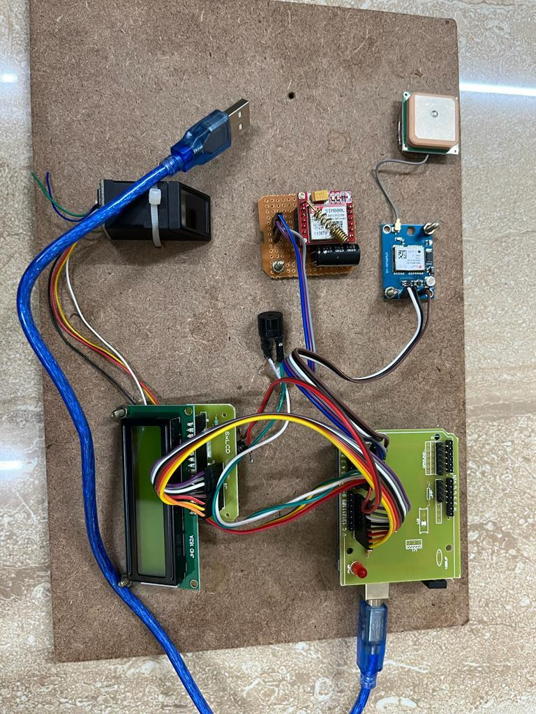
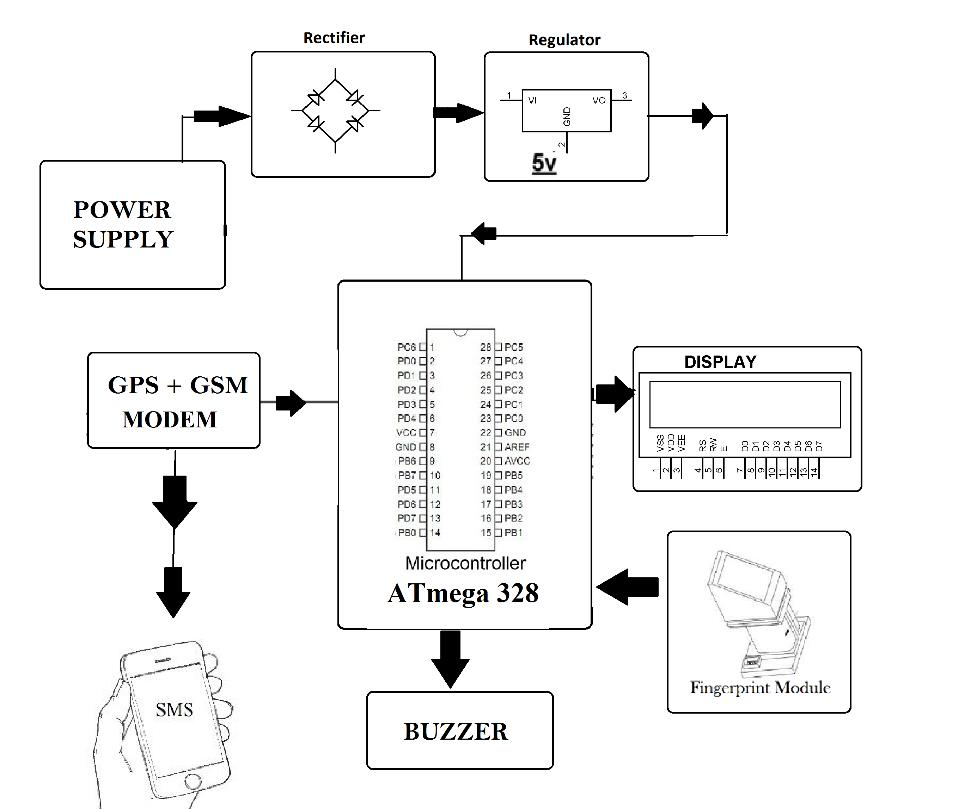
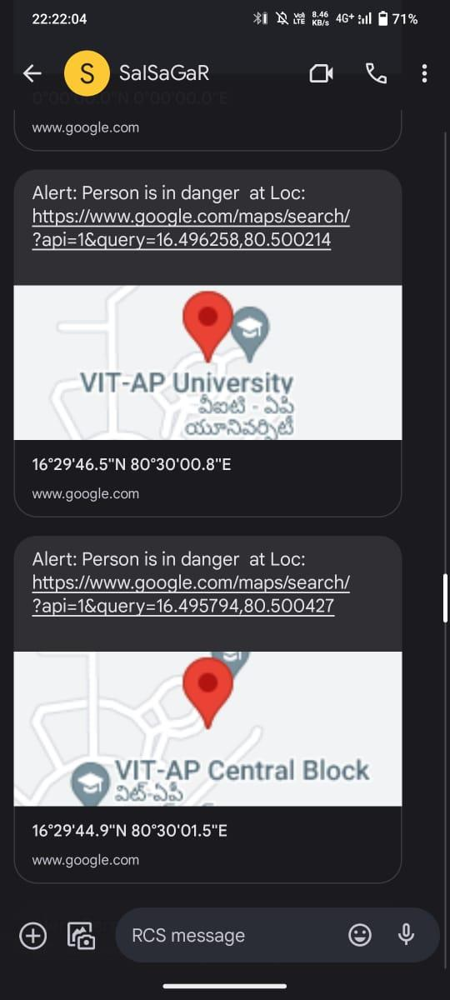
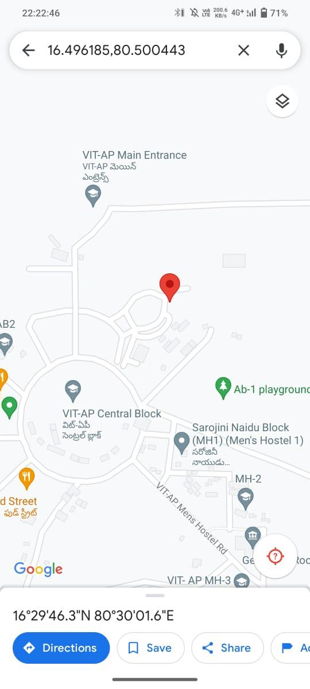

# 🆘 Women Safety Device with GPS Tracking & Alerts

> **ECS Project** · VIT-AP University  
> **Team:** A.V.S.M.K Swamy · Sathvik · Hemanth · **Samuel (21BCB7145)** · Nihal · Sai Sagar  
> **Guide:** Dr. Syed Khasim · SCOPE, VIT-AP

-----

## 📌 Overview

A standalone embedded IoT safety device that sends **automatic GPS-location SMS alerts** to emergency contacts when the user is in danger — even if unconscious or unable to act.
 
**Key insight:** The device works in reverse — it alerts automatically if the user *stops* checking in, rather than requiring them to press a button when attacked.

-----

## 🔧 Hardware Prototype
 

 
---
 
## 🔌 Circuit Diagram
 

 
---

## ⚙️ How It Works
  
```
DEVICE ACTIVATED
    ↓
Continuous fingerprint scan required every 60 seconds
    ↓
SAFE: Finger detected → timer resets → stays silent
    ↓
DANGER: No scan for 60s (unconscious / attacked / restrained)
    ↓
  ┌─────────────────────┐    ┌────────────────────────────────┐
  │  BUZZER SOUNDS      │    │  SMS + Google Maps link sent   │
  │  (alerts bystanders)│    │  to all emergency contacts     │
  └─────────────────────┘    └────────────────────────────────┘
```
**Key Insight:** The user doesn’t need to *do* anything in an emergency — the device acts automatically if she *stops* responding.

-----

## 📱 SMS Alert



## 📍 Location Coordinates


 
**SMS format:**
```
Alert: Person is in danger at Loc:
https://www.google.com/maps/search/?api=1&query=LAT,LON
```
 
---

## 🔧 Hardware Components

|Component              |Purpose                             |
|-----------------------|------------------------------------|
|**Arduino Uno**        |Main microcontroller                |
|**GSM Module**         |Send SMS alerts via cellular network|
|**GPS Module**         |Get real-time location coordinates  |
|**Fingerprint Scanner**|Authenticate the registered user    |
|**LCD Display (16×2)** |Status messages to the user         |
|**Buzzer**             |Audio alarm for nearby people       |
|**LED indicators**     |Visual status feedback              |
|**Push Buttons**       |Enrollment trigger                  |
|**Power Supply**       |Portable battery-powered            |

-----

## 💻 Software

|Component    |Details                                                                                  |
|-------------|-----------------------------------------------------------------------------------------|
|**IDE**      |Arduino IDE                                                                              |
|**Language** |C (Arduino/ATmega328)                                                                    |
|**Libraries**|`Adafruit_Fingerprint.h` · `TinyGPS.h` · `LiquidCrystal.h` · `SoftwareSerial` · `Servo.h`|

-----

## ⚙️ Key Functions

### Fingerprint Enrollment (`enroll_finger()`)

1. Prompts user to input an ID
1. Captures 2 images of the same finger
1. Converts to templates and matches them
1. Stores the fingerprint model in sensor memory

### GPS Reading (`read_gps()`)

- Continuously parses NMEA data from GPS module
- Extracts latitude/longitude in real-time

### SMS Alert (`send_sms()`)

- Sends AT commands to GSM module
- Message includes: alert text + Google Maps link with coordinates
- Sent to all pre-registered emergency numbers

### Main Loop (`loop()`)

```
Every cycle:
  → Read GPS coordinates
  → Display "Scan Thumb" on LCD
  → Wait for fingerprint scan
  → If recognized: reset 60s timer
  → If timer expires: trigger buzzer + send SMS
```

-----

### 📁 Project Structure
 
```
women-safety-device/
├── images/
│   ├── hardware_prototype.png      # Actual hardware photo
│   ├── circuit_diagram.png         # Full circuit diagram
│   ├── system_block_diagram.png    # System architecture
│   ├── flowchart.png               # Working flowchart
│   └── sms_alert_screenshot.png   # SMS alert example
├── women_safety_device.ino         # Main Arduino sketch
└── README.md
```
 
---

## 🚀 How to Deploy
 
```
1. Install required libraries in Arduino IDE
   (Sketch → Include Library → Manage Libraries):
   - Adafruit Fingerprint Sensor Library
   - TinyGPS
   (LiquidCrystal and SoftwareSerial are built-in)
 
2. Update emergency contact numbers in women_safety_device.ino:
   Serial.print("AT+CMGS=\"XXXXXXXXXX\"\r\n");  ← Contact 1
   Serial.print("AT+CMGS=\"XXXXXXXXXX\"\r\n");  ← Contact 2
 
3. Wire components to Arduino Uno:
   - LCD (16×2)         : RS=8, E=9, D4=10, D5=11, D6=12, D7=13
   - Fingerprint sensor : RX=2, TX=3 · VCC=3.3V
   - Buzzer             : Pin 5
   - Enroll button      : Pin 6
 
4. Open women_safety_device.ino in Arduino IDE
5. Select Board: Arduino Uno → select COM Port → Upload
 
6. Enroll fingerprint (first time only):
   - Hold enroll button while powering on
   - Place finger → remove → place again
   - Enrollment confirmed on LCD
 
7. Normal operation:
   - Power on → LCD shows SCAN THUMB.. with live GPS coordinates
   - Place registered finger every 60s to stay safe
   - No scan for 60s → buzzer + SMS alert triggered automatically
```
---

## 📹 Demo Video

🎥 [Watch Working Prototype →] <a href="https://drive.google.com/file/d/1TGw5IVlSfi0Cq1VD3_UB_F7JaSD6vcau/view?usp=sharing">https://drive.google.com/file/d/1TGw5IVlSfi0Cq1VD3_UB_F7JaSD6vcau/view?usp=sharing</a>
 
---

## 🔮 Future Scope

- [ ] Compact into a **wearable** form factor (bracelet/pendant)
- [ ] Support **multiple emergency contacts**
- [ ] Two-way voice call capability
- [ ] Integration with **local police station numbers**
- [ ] Mobile app companion for remote status monitoring

-----

*VIT-AP University · SCOPE · ECS Project 231137*
